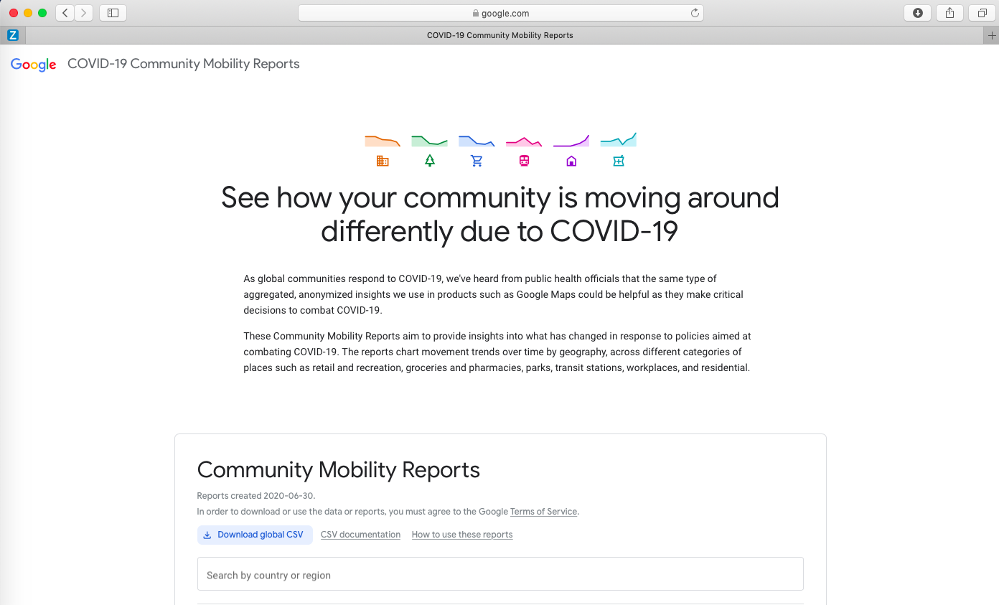

```{r setup, include=FALSE}
knitr::opts_chunk$set(echo = FALSE)

```

## Agenda

1. Q&A
1. Case study: Google mobility and excess mortality
1. **Break** 
1. Dissect study

## Q&A

- Questions about the assignment
- Questions about digital trace data
- Other?

# Case study: Google mobility and excess mortality

## Introduction

**Background**

- Non-pharmaceutical interventions to contain COVID-19  

**Goal**

- Assess effectiveness of NPIs in reducing mortality burden

**Approach**

- Excess mortality and human mobility at regional level in England and Wales (Feb-Aug 2020)
- Cross-sectional analysis and mixed-effect regression models 


\tiny Basellini, U., **Alburez-Gutierrez, D.**, Del Fava, E., Perrotta, D., Bonetti, M., Camarda, C. and Zagheni, E. (2020). "Linking excess mortality to Google mobility data during the COVID-19 pandemic in England and Wales". SocArxiv. DOI:[10.31235/osf.io/75d6m](https://dx.doi.org/10.31235/osf.io/75d6m).

## Mortality data: death counts


\tiny Weekly deaths registered in the region of London. Week 1, 2015 -- Week 39, 2020. *Source: ONS (2020)*

## Mortality data: excess mortality rate


\tiny Excess mortality rate (per 100,000 individuals) in the region of London. Week 1, 2015 -- Week 39, 2020. *Source: elaborations of data from ONS (2020)*

## Excess mortality rate by region


\tiny Excess mortality rate (per 100,000 individuals) by region. Week 1, 2015 -- Week 39, 2020. *Source: elaborations of data from ONS (2020)*

## Mobility data: Google Community Reports



\tiny Available at \url{https://www.google.com/covid19/mobility/}

## Mobility data: grocery \& stay-at-home


\tiny Relative change in visits to groceries and pharmacies and time spent at home with respect to start of 2020. Region of London,  weeks 8--11, 2020 (15 February -- 13 March). *Source: elaborations of data from Google (2020)*

## Mobility data: grocery \& stay-at-home


\tiny Relative change in visits to groceries and pharmacies and time spent at home with respect to start of 2020. Region of London,  weeks 8--12, 2020 (15 February -- 20 March). *Source: elaborations of data from Google (2020)*

## Mobility data: grocery \& stay-at-home


\tiny Relative change in visits to groceries and pharmacies and time spent at home with respect to start of 2020. Region of London,  weeks 8--14, 2020 (15 February -- 04 April). *Source: elaborations of data from Google (2020)*

## Mobility data: grocery \& stay-at-home


\tiny Relative change in visits to groceries and pharmacies and time spent at home with respect to start of 2020. Region of London,  weeks 8--39, 2020 (15 February -- 25 September).  *Source: elaborations of data from Google (2020)*

## Google mobility index

1. Reduce dimensionality of mobility data retaining variation
1. [Category, regions, time] $\rightarrow$ [regions, time]
1. Multilinear principal component analysis (first component)
1. `rTensor` package

## Google mobility index


## Excess mortality \& mobility (Google mobility index)


## Excess mortality \& lagged mobility (Google mobility index)


<!-- ## Regression analysis -->

<!-- xx -->

## Model results


## Counterfactual analysis


## Conclusions

1. Association between mobility reduction and excess mortality 
1. Lag of five or more weeks
1. Results confirmed in regression setting accounting for pandemic time trend and regional differences
1. Estimated 93,700 (85,400-102,500) excess deaths 
1. Doubled without mobility reductions  

## Limitations

**Groups discussion after break...**

# Break

# Discussion

## Group discussion: research design

{width=40px}

The papers links mobility restrictions to excess mortality:

1. What are some **strenghts** of the research design?
1. What are some **weaknesses** of the research design?

## Analysis of research design

*Strenghts*

1. Excess mortality as outcome (alternative definitions)
1. Account for infection-death lag

*Weaknesses*

1. Ecological study
1. Mortality reporting (accuracy, lags)

## Group discussion: digital trace data

{width=40px}

The papers users Google mobility data as an explanatory variable:

1. What are some **strenghts** of the use of digital trace data?
1. What are some **weaknesses** of the use of digital trace data?

## Use of digital trace data

*Strengths*

1. Real-time mobility data
1. Uses different measures of mobility

*Weaknesses*

1. Internet penetration rates
1. Algorithmic black-box of Google data

<!-- # Appendix -->

<!-- ## Deaths by region -->

<!--  -->

<!-- \tiny Weekly deaths registered in England and Wales by region. Week 1, 2015 -- Week 39, 2020. *Source: ONS (2020)* -->

<!-- ## Regional mobility data -->

<!--  -->

<!-- \tiny Relative change in visits to groceries and pharmacies and time spent at home  with respect to start of 2020. England \& Wales by region, weeks 8--39, 2020 (15 February -- 25 September). *Source: elaborations of data from Google (2020)* -->

<!-- ## Regional excess mortality \& mobility (Google mobility index) -->

<!--  -->

<!-- ## Excess mortality \& lagged mobility (grocery) -->

<!--  -->

<!-- ## Excess mortality \& lagged mobility (home) -->

<!--  -->

<!-- ## Counterfactual analysis (detail) -->

<!-- \begin{table}[!ht]\centering -->
<!-- \begin{tabular}{@{}l|rrrr @{ ; } l} -->
<!-- \toprule -->
<!-- Region                   & \begin{tabular}[c]{@{}r@{}}Population \\ (2019)\end{tabular} & \begin{tabular}[c]{@{}r@{}}Estimated \\ excess deaths\end{tabular} & \begin{tabular}[c]{@{}r@{}}Deaths averted \\ (counterfactual)\end{tabular} &  \multicolumn {2}{ c }{ 95\% CI } \\ \midrule -->
<!-- North East               & 2,669,941   & 4,100 & 3,600  & (3,300 &  4,100)  \\ -->
<!-- North West               & 7,341,196   & 9,000 & 12,600 & (11,600 & 13,500)  \\ -->
<!-- Yorkshire and The Humber & 5,502,967   & 5,100 & 6,200  & (5,600 & 7,100)  \\ -->
<!-- East Midlands            & 4,835,928   & 4,400 & 5,900  & (5,200 & 6,700)  \\ -->
<!-- West Midlands            & 5,934,037   & 7,200 & 10,600  & (9,700 & 11,400)  \\ -->
<!-- East                     & 6,236,072   & 6,300 & 9,500  & (8,600 & 10,500)  \\ -->
<!-- London                   & 8,961,989   & 11,000 & 22,200 &  (20,900 & 23,100)  \\ -->
<!-- South East               & 9,180,135   & 9,300 & 12,800  & (11,700 & 14,400)  \\ -->
<!-- South West               & 5,624,696   & 3,800 & 6,400   & (5,700 & 7,400)  \\ -->
<!-- Wales                    & 3,152,879   & 1,900 & 3,800  & (3,300 & 4,400) \\ \midrule -->
<!-- Total                    & 59,439,840  & 62,100  & 93,700   & (85,400 & 102,500)  \\ \bottomrule -->
<!-- \end{tabular} -->
<!-- \end{table} -->